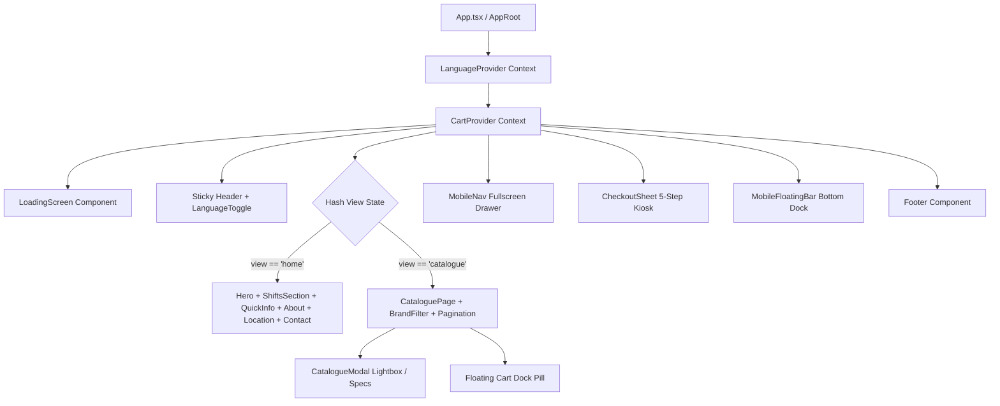

# Technical Architecture & System Overview

This document details the software architecture, state lifecycle, routing topology, and code organization of the SKL Waste Hardware web application.

---

## 1. High-Level System Topology



---

## 2. Directory Structure & File Map

```
sklwaste/
├── AI_CHEATSHEET.md           # Instant AI indexing & quick lookup guide
├── AGENTS.md                  # Binding design & engineering standards
├── index.html                 # HTML5 entry with preconnected Google Fonts & metadata
├── vite.config.ts             # Vite build configuration with chunk splitting
├── docs/                      # Architectural & developer documentation
│   ├── ARCHITECTURE.md        # System architecture and routing (this document)
│   ├── COMPONENTS.md          # 19-component registry & prop interfaces
│   ├── DESIGN_SYSTEM.md       # Apple-grade design tokens, grid & animations
│   ├── CHECKOUT_WORKFLOW.md   # 5-step kiosk engine & WhatsApp dispatch
│   ├── CATALOGUE_DATA.md      # Product database, schema, UOMs & pagination
│   └── I18N_AND_COPY.md       # Bilingual setup & copywriting standards
├── src/
│   ├── App.css                # Master design stylesheet (7,900+ lines)
│   ├── index.css              # Global tokens, resets, typography variables
│   ├── App.tsx                # App shell, hash router, and section orchestration
│   ├── main.tsx               # React root mount with StrictMode & Context providers
│   ├── components/            # 19 single-responsibility React components
│   │   ├── About.tsx
│   │   ├── CatalogueModal.tsx
│   │   ├── CataloguePage.tsx
│   │   ├── CheckoutSheet.tsx
│   │   ├── ContactSection.tsx
│   │   ├── Footer.tsx
│   │   ├── Gallery.tsx
│   │   ├── GalleryLightbox.tsx
│   │   ├── HardwareEnquiries.tsx
│   │   ├── Header.tsx
│   │   ├── Hero.tsx
│   │   ├── LanguageToggle.tsx
│   │   ├── LoadingScreen.tsx
│   │   ├── LocationSection.tsx
│   │   ├── MobileFloatingBar.tsx
│   │   ├── MobileNav.tsx
│   │   ├── QuickInfo.tsx
│   │   ├── ReviewsSummary.tsx
│   │   └── ShiftsSection.tsx
│   ├── context/
│   │   ├── CartContext.tsx
│   │   ├── cartTypes.ts
│   │   ├── LanguageContext.tsx
│   │   ├── languageContextDefinition.ts
│   │   └── useLanguage.ts
│   ├── data/
│   │   ├── all-products.json       # Master 1,081 products raw JSON database
│   │   ├── business.ts             # Authentic business credentials, contacts, hours
│   │   ├── catalogue.ts            # Type definitions, category lists, arrays
│   │   └── translations.ts         # Bilingual dictionary (EN & BM)
│   ├── hooks/
│   │   └── useDragToDismiss.ts     # Touch & mouse drag-to-dismiss gesture engine
│   └── utils/
│       └── asset.ts                # Base-path URL resolution utility
└── thirumalvel/                    # Identical synchronized mirror codebase
```

---

## 3. Dual-Tree Synchronization Protocol

The project maintains a dual directory structure:
- `src/`: Primary active source directory used by Vite.
- `thirumalvel/src/`: Synchronized mirror directory maintained for multi-workspace consistency.

### Synchronization Rule:
Whenever any file is modified in `src/`, copy the identical file to `thirumalvel/src/`. This applies to:
- `src/App.css` ➔ `thirumalvel/src/App.css`
- `src/components/*.tsx` ➔ `thirumalvel/src/components/*.tsx`
- `src/data/*.ts` ➔ `thirumalvel/src/data/*.ts`
- `src/context/*.ts` ➔ `thirumalvel/src/context/*.ts`

---

## 4. Hash-Based Router Architecture

The application uses an ultra-fast zero-latency hash router in [`src/App.tsx`](file:///c:/Users/Nithya/sklwaste/src/App.tsx):

- **`#catalogue`**: Renders the full [`CataloguePage`](file:///c:/Users/Nithya/sklwaste/src/components/CataloguePage.tsx) portal with 20-item pagination, category filters, and search.
- **`#hero` / Empty / Any other hash**: Renders the main marketing and business overview page (`Hero`, `ShiftsSection`, `QuickInfo`, `About`, `LocationSection`, `ContactSection`).
- Sub-anchors (`#about`, `#location`, `#contact`) automatically smooth-scroll to their respective section IDs.

### Router State Transition Lifecycle:
```ts
const navigateTo = (view: "home" | "catalogue", hash?: string) => {
  setCurrentView(view);
  if (view === "catalogue") {
    window.location.hash = "#catalogue";
    window.scrollTo({ top: 0, behavior: "smooth" });
  } else {
    // Navigate home and scroll to hash or top
    ...
  }
};
```

---

## 5. Global State Management

### 1. `LanguageContext`
- **State**: `language: "en" | "ms"`, `t: Translations`, `setLanguage: (lang) => void`
- **Storage**: Automatically persisted in browser `localStorage.getItem("skl_lang")`.
- **HTML Document Sync**: Updates `document.documentElement.lang = "en" | "ms"`.

### 2. `CartContext`
- **State**:
  - `items: CartItem[]`: Current items in cart with ID, title, UOM (`unit`), quantity, price, image.
  - `totalCount: number`: Total sum of all item quantities.
  - `transportMode: "day" | "night"`: Selected delivery schedule.
  - `paymentMethod: "cash" | "transfer" | "qr"`: Selected payment method.
  - `isCheckoutOpen: boolean`: Toggle for the fullscreen 5-step kiosk.
- **Operations**: `addToCart`, `updateQuantity`, `removeFromCart`, `clearCart`, `openCheckout`, `closeCheckout`.
